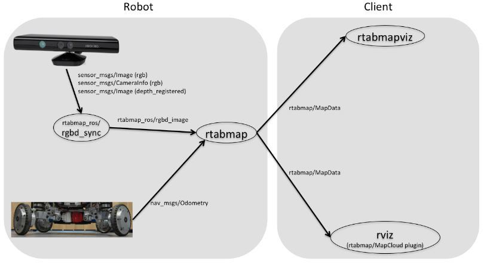

# rtabmap mapping and navigation

http://wiki.ros.org/rtabmap_ros

## mapping

开启L515相机连接

```bash
roslaunch realsense2_camera rs_camera.launch \
    align_depth:=true \
    unite_imu_method:="linear_interpolation" \
    enable_gyro:=true \
     enable_accel:=true

rosrun imu_filter_madgwick imu_filter_node \
    _use_mag:=false \
    _publish_tf:=false \
    _world_frame:="enu" \
    /imu/data_raw:=/camera/imu \
    /imu/data:=/rtabmap/imu
```

开启mapping模式

```bash
rosrun nodelet nodelet standalone rtabmap_ros/point_cloud_xyz \
    _approx_sync:=false  \
    /depth/image:=/camera/depth/image_rect_raw \
    /depth/camera_info:=/camera/depth/camera_info \
    _decimation:=4

roslaunch rtabmap_ros rtabmap.launch\
    rtabmap_args:="\
      --delete_db_on_start \
      --Icp/VoxelSize 0.05 \
      --Icp/PointToPlaneRadius 0 \
      --Icp/PointToPlaneK 20 \
      --Icp/CorrespondenceRatio 0.2 \
      --Icp/PMOutlierRatio 0.65 \
      --Icp/Epsilon 0.005 \
      --Icp/PointToPlaneMinComplexity 0 \
      --Odom/ScanKeyFrameThr 0.7 \
      --OdomF2M/ScanMaxSize 15000 \
      --Optimizer/GravitySigma 0.3 \
      --RGBD/ProximityPathMaxNeighbors 1 \
      --Reg/Strategy 1" \
    icp_odometry:=true \
    scan_cloud_topic:=/cloud \
    subscribe_scan_cloud:=true \
    depth_topic:=/camera/aligned_depth_to_color/image_raw \
    rgb_topic:=/camera/color/image_raw \
    camera_info_topic:=/camera/color/camera_info \
    approx_sync:=false \
    wait_imu_to_init:=true \
    imu_topic:=/rtabmap/imu 
    #设置'rviz:=true'对于使用rviz的情况 
```

录制数据储存地址~/.ros/rtabmap.db

回放数据

```bash
rtabmap-databaseViewer ~/.ros/rtabmap.db
```

对实验室西侧靠窗区域mapping生成的地图：


## navigation

### 利用turtlebot3仿真

打开gazebo模型

```bash
export TURTLEBOT3_MODEL=waffle
roslaunch turtlebot3_gazebo turtlebot3_world.launch
```

也可以使用turtlebot3_gazebo下其他模型

开启导航：

```bash
export TURTLEBOT3_MODEL=waffle
roslaunch rtabmap_ros demo_turtlebot3_navigation.launch
```

仿真效果：


### 利用tracer mini与L515实现现实导航

目前采用以下框架，在launch/robot_setting中完成了move_base和tf变换信息的输入

但是tf的准确数据并没有测量，move_base的参数也没有修改（使用样例参数）



目前按照mapping的逻辑运行rtabmap并启动底盘，之后再运行robot_setting.launch会导致在rviz中可以生成栅格地图，也可以显示坐标变换，但导航功能无法启动，既不能发布导航指令也不能发布速度指令，所以应该还是在rtabmap和move_base之间的参数设置有问题。


另一个tracer_mapping.launch是在demo_turtlebot3_navigation.launch的基础上修改的，理论上打开摄像头和底盘后只需要运行这一个launch即可，但是会出现节点订阅未发布话题问题，应该是在launch内部对rtabmap的参数设置有问题。


参考：

move_base框架：


turtlebot中利用rtabmap的框架：


tracer 发布的topic：

- /cmd_vel
- /odom
- /tf

该tf只发布odom->base_link的变换
